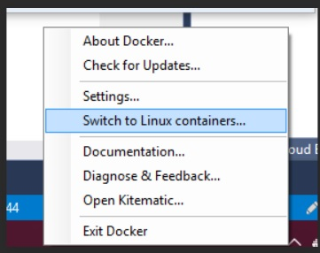

# Install Pre-requisites

* Install WSL2 on windows 11
https://docs.microsoft.com/en-us/windows/wsl/install

* Install docker desktop
https://hub.docker.com/editions/community/docker-ce-desktop-windows

Verify docker desktop is running with "Linux container" mode




Open command prompt/powershell

clone the repo wih the branch banide/e2e-demo

```
git clone https://github.com/banibrata/various-demos.git 
```


Go inside notebooks_on_docker_demo  and run docker build


```
cd various-demos/notebooks_on_docker_demo
docker build --pull --rm -f "dockerbuild/sdk_test_ubuntu.dockerfile" -t sdkv2-samples:latest "." 
```

Start the docker container
```
docker run --name sample_container --rm -p 8888:8888 -it sdkv2-samples:latest
```

Run this command in the container:

```
bash .start_jupyter.sh
```
Open [http://localhost:8888/lab](http://localhost:8888/lab)